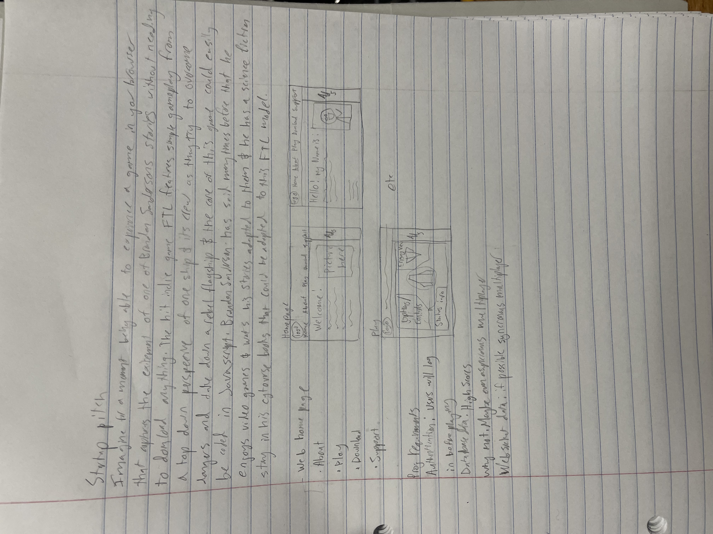

# CS260_StartUp
## the pitch
The pitch is simple: Imagine playing a game that captures the wonder of Brandon sandersons works. He writes compelling stories and has said that he wants someone to adapt his stories into video games, why not do that here? The hit indie game FTL is a simple top down 2-d game where the player controls crew on a space ship, Brandodn Sanderson has a sci fi series caled the cytoverse that could be used for a FTL like game that you could play in the browser. Plus in case we couldnt pair it with Brandon Sandersons works his cytoverse is strongly inspired by already existing fiction so if the game was built and had to be debranded it would be very easy.

## meeting the requirements
I listed in the photo how I hope to meet the project requirements but to repeat.

**Authentication** Simply I will have a log in process

**Database Data** I will record high scores, and possibly data for asyncronous online play

**Web socket data** Ideally I want syncronous online play, but barring that some kind of chat could work too

## key gameplay features
For those unfamiliar with FTL the gameplay loop is simple. A textbox appears explaining the current situation and the player makes choices. If a choice of theirs would put them in danger the combat phase begins where the players ship and whatever threat its facing begins being simulated. You decide how to allocate power and wether to attack untill you escape, defeat the enemy or are defeated. While real time combat like FTL uses might not be reaosnable for this project this gameplay loop should be easily made turn based.

# Startup HTML deployment
So I've gone over and reworked the simon sample code to fit my project. I found that the sample code used a bunch of code elements we hadnt been taught so I replaced any code I didnt understand with code I was familiar with to ensure I could alctually work with the html I had. I went and made a picture as well which I uploaded which serves as a sneek peek into the vision. 
Once I start using CSS though this page needs a lot of work. Firstly the page is hideous but html is primarily for structure so I didnt bother trying to color the backhround and adding side bars and such. Once I have css I need to narrow the top index, change the background color, etc. I also want to add background music to the game page but that might need to be connected to the javascript so we'll see.
